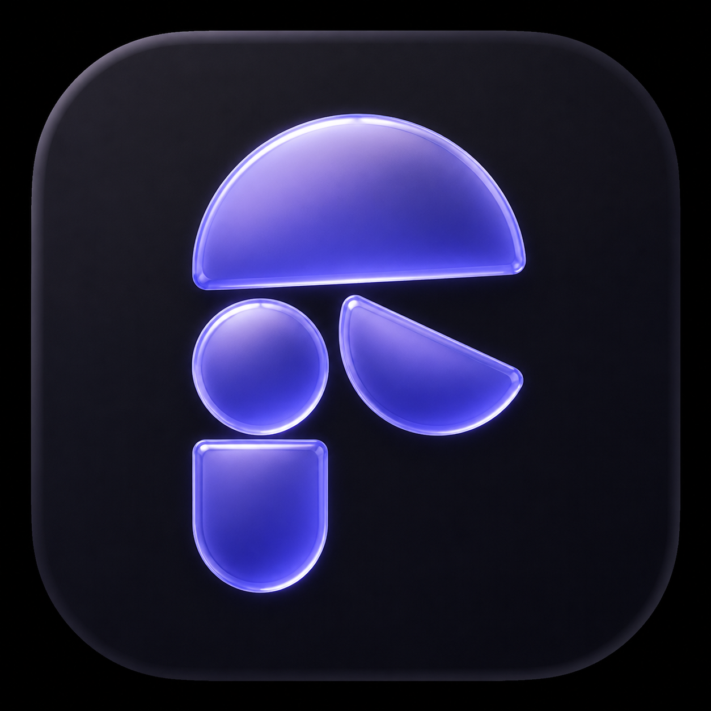

<p align="center">
  
</p>

<h1 align="center">FigCodex</h1>

<p align="center">
  在 Figma 裡使用本機 Codex 檢查、理解並修改畫布的設計 Agent。
</p>

<p align="center">
  <a href="./README.md">English</a> ·
  <a href="./CONTRIBUTING.md">參與開發</a> ·
  <a href="./LICENSE">MIT 授權</a> ·
  <a href="./NOTICE.md">來源標示</a>
</p>

> [!IMPORTANT]
> FigCodex 是以 [PavelLaptev/FigClaw](https://github.com/PavelLaptev/FigClaw) 為基礎的衍生作品，依 MIT License 使用與修改。FigCodex 將原本的 Claude API 串接改為本機 Codex CLI bridge，並新增不同的執行架構、權限模式、介面與功能。完整說明請見 [NOTICE.md](NOTICE.md)。

FigCodex 會把 Figma 外掛連接到 Mac 上已安裝、已登入的 Codex CLI。Figma 裡不需要填 Claude API Key，也不需要另外保存 OpenAI 模型 API Key。本機 bridge 使用 Codex App Server，讓單一 Codex turn 可以讀取畫布、呼叫 Figma 工具、接收結果後繼續推理，並在之後續接同一個 Codex thread。

FigCodex 是獨立的社群專案，與 Figma、Anthropic、OpenAI 均無隸屬或官方背書關係。

## FigCodex 新增的功能

相較於上游 FigClaw，目前 FigCodex 包含：

- **本機 Codex 執行環境**：透過 Codex CLI App Server 與既有的 Codex／ChatGPT 登入執行，不再由外掛 iframe 直接呼叫 Claude API。
- **即時模型設定**：讀取本機 CLI 實際提供的模型與 reasoning effort，在 Send 旁即可切換。
- **原生 thread 續接**：保存 Codex thread ID，後續訊息與跨 Figma 檔案恢復聊天時會繼續同一個 conversation。
- **感知畫布選取內容**：送出前會在 composer 顯示選取的文字、圖片、Frame 或混合節點；視覺節點包含有上限的渲染預覽，文字節點包含有上限的文字與樣式資料。
- **參考圖片**：同一則訊息可加入上傳圖片、貼上的圖片，以及 Figma 選取節點的圖片預覽。
- **自動權限審查**：唯讀檢查可直接執行；會修改 Figma 或要求專案檔案權限的操作會先自動審查，無法確認時採 fail-closed。
- **唯讀 Codex 檔案沙箱**：Codex 預設以專案為最小 runtime root；只有使用者明確要求專案檔案工作時，才能提出自動審查的權限升級。
- **有驗證的本機傳輸**：bridge 只綁定 loopback，並要求持久保存的隨機 pairing token。
- **macOS 常駐 bridge**：可安裝使用者層級 LaunchAgent，登入時啟動，意外退出時自動重啟。
- **Skills**：上傳 Markdown skill、設為每回合啟用、用 `@mention` 叫用 passive skill，或讓 Agent 建立與更新 skill。
- **歷史記錄與遷移**：聊天可跨 Figma 檔案保存，並相容匯入舊 FigClaw 的設定、歷史、skills 與 pairing token。
- **FigCodex 視覺介面**：包含紫色玻璃品牌圖形、Codex 一致的字體、連線狀態、審查狀態，以及適合 400 px 外掛面板的模型／effort 選單。

## 架構

```text
Figma plugin UI
    ⇅ 已驗證 WebSocket（ws://localhost:4319/ws）
FigCodex 本機 bridge
    ⇅ stdio JSON-RPC
codex app-server
    ⇅ dynamic tool 呼叫與審查結果
Figma plugin sandbox → 目前的 Figma 文件
```

FigCodex 不會為每個 prompt 重新啟動一次 `codex exec`。App Server 可以在同一回合暫停並等待 client tool、接收 Figma 結果、繼續串流回答，之後也能恢復相同 thread。

## Figma 工具

| 工具 | 用途 |
| --- | --- |
| `get_selection` | 讀取目前選取項目與序列化節點資料。 |
| `get_page_nodes` | 在限制深度內讀取目前頁面的節點樹。 |
| `get_node_by_id` | 檢查指定 Figma node。 |
| `get_styles` | 列出本機 paint、text、effect 與 grid styles。 |
| `get_variables` | 讀取 variables collection、modes 與解析值。 |
| `get_components` | 列出 components 與 component sets。 |
| `get_pages` | 列出頁面與子節點數量。 |
| `run_figma_code` | 執行通過審查、支援頂層 `await` 的 Figma Plugin API JavaScript。 |
| `fetch_docs` | 讀取 allowlist 內的 Figma Plugin API 參考文件。 |
| `notify` | 顯示 Figma toast。 |
| `download_files` | 下載產生的文字或二進位檔案，多檔時可使用 ZIP。 |
| `create_skill`／`update_skill` | 將 Agent 建立或修改的 skill 保存到外掛。 |

## 系統需求

- macOS 與 Figma desktop app
- Node.js 18 以上
- 支援 App Server dynamic tools 的新版 Codex CLI
- 已透過 ChatGPT 登入 Codex CLI；獨立 CLI 可執行 `codex login`

FigCodex 會依序搜尋 `CODEX_BIN`、目前 Node／NVM 安裝、ChatGPT desktop app 內附的 Codex，以及 `PATH`，再選擇相容版本中最新的執行檔。如需固定版本，可設定 `CODEX_BIN=/absolute/path/to/codex`。

## 安裝

```bash
npm install
npm run build
npm run bridge:install
npm run bridge:token
```

`bridge:install` 會將 `com.figcodex.bridge` 註冊為 macOS 使用者層級 LaunchAgent。它會在登入時啟動、意外結束後自動重啟，並把本機 log 寫入 `.figcodex-data/`。

接著匯入 Figma 外掛：

1. 開啟 Figma desktop。
2. 選擇 **Plugins → Development → Import plugin from manifest…**。
3. 選取本專案的 `public/manifest.json`。
4. 開啟 FigCodex → **Settings**。
5. Bridge URL 保持 `http://localhost:4319`。
6. 貼上 `npm run bridge:token` 顯示的 token，按 **Save & Connect**。
7. 等待顯示 **Connected**，回到 **Chat**。

## 使用方式

1. 可先在 Figma 畫布選取一個或多個圖層。相關內容會出現在 composer，送出前可以排除。
2. 輸入要求、貼上或上傳參考圖片，也可以用 `@skill-name` 叫用 passive skill。
3. 需要時在 **Send** 左側選擇 Codex 模型與 reasoning effort。
4. 執行期間可在對話中看到串流回答、工具與自動審查狀態。

範例：

- 「說明目前選取的元件與 variants。」
- 「建立一個 auto layout button，padding 16/10、圓角 8。」
- 「把目前選取內容的顏色與文字樣式轉成 Figma variables。」
- 「把所有選取圖層改成適合檔名的命名。」
- 「把本頁所有 icon frame 匯出成 SVG 與 PNG。」
- 「依照這張參考圖重新設計選取的 card。」

## Skills

自訂 skill 是 Markdown 指令文件：

- **Active**：每個 turn 都會加入。
- **Passive**：只有以 `@skill-name` 指定時才會加入。
- Agent 可以透過受審查的 dynamic tools 建立或更新 skill。
- 範例位於 [`skills/`](skills/)。

第三方 skill 應視為類似程式碼的指令；啟用前請先閱讀內容。

## 安全與權限

- Bridge 預設只綁定 `127.0.0.1`，沒有 pairing token 的 client 會被拒絕。
- Pairing token 與 Codex 登入憑證只留在本機，不會加入 prompt。
- Codex 以 `sandbox: read-only`、`approvalPolicy: on-request`、`approvalsReviewer: auto_review` 啟動。
- 會產生副作用的 FigCodex tools 會先通過 bridge 端獨立、fail-closed 的審查，才會送進 Figma。
- Figma manifest 沒有 wildcard 網路權限，只允許本機 bridge 與 allowlist 文件來源。
- 畫布選取預覽在按下 Send 前不會離開外掛。
- `.figcodex-data/`、`.figclaw-data/`、logs、tokens 與產生的 App Server schemas 都不會加入 git。

`run_figma_code` 可以修改目前開啟的 Figma 文件。重要檔案請保留 version history，並依操作影響程度檢查產生的行為。

## 常用指令

| 指令 | 說明 |
| --- | --- |
| `npm run dev` | 監看並重新建置外掛。 |
| `npm run build` | 建置 `public/index.html` 與 `public/code.js`。 |
| `npm run check` | 建置並執行所有本機測試。 |
| `npm run bridge` | 只在目前 terminal 執行 bridge。 |
| `npm run bridge:install` | 安裝並啟動 macOS 常駐使用者服務。 |
| `npm run bridge:status` | 檢查常駐 bridge 狀態。 |
| `npm run bridge:uninstall` | 停止並移除常駐 bridge。 |
| `npm run bridge:token` | 顯示持久保存的 pairing token。 |
| `npm run bridge:smoke` | 測試真實 Codex tool call 與 thread resume。 |
| `npm run bridge:review-smoke` | 測試會修改 Figma 的工具是否經過自動審查。 |
| `npm run bridge:permissions-smoke` | 測試自動審查的專案檔案寫入。 |
| `npm run bridge:selection-smoke` | 測試選取 metadata 與 local image input。 |
| `npm run codex:schema` | 產生目前實驗性 App Server TypeScript bindings。 |

## 專案結構

```text
bridge/                 Codex 探測、App Server client、bridge、審查器
scripts/                常駐服務、token、schema、smoke tests
src/UI.svelte           外掛 iframe 與 Codex event/tool routing
src/code.ts             Figma sandbox、storage、選取擷取、工具執行
src/tools.ts            dynamic-tool schemas
src/system-prompt.md    Figma Agent 指令
src/components/         Svelte UI
skills/                 Markdown skill 範例
test/                   unit 與 security-contract tests
public/                 Figma manifest 與產生的 build
docs/attribution/       保留的 FigClaw 上游宣傳素材
```

`public/` 內的產生檔案應透過 build 更新，不要手動編輯。

## 參與開發

Repository 的工程限制請先讀 [AGENTS.md](AGENTS.md)，本機開發流程請見 [CONTRIBUTING.md](CONTRIBUTING.md)。功能行為改變時，請同步更新英文與繁體中文文件。

## 來源與授權

FigCodex 基於 Pavel Laptev 建立的 [PavelLaptev/FigClaw](https://github.com/PavelLaptev/FigClaw)。上游專案採 MIT License，原始版權聲明已完整保留。

FigCodex 同樣以 [MIT License](LICENSE) 開源。完整來源標示與重大修改摘要請見 [NOTICE.md](NOTICE.md)。
